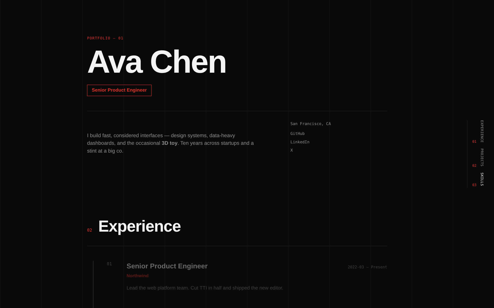
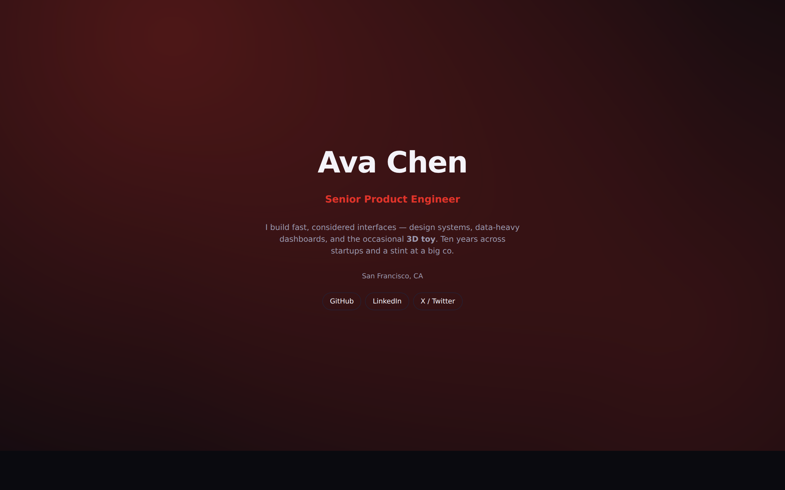
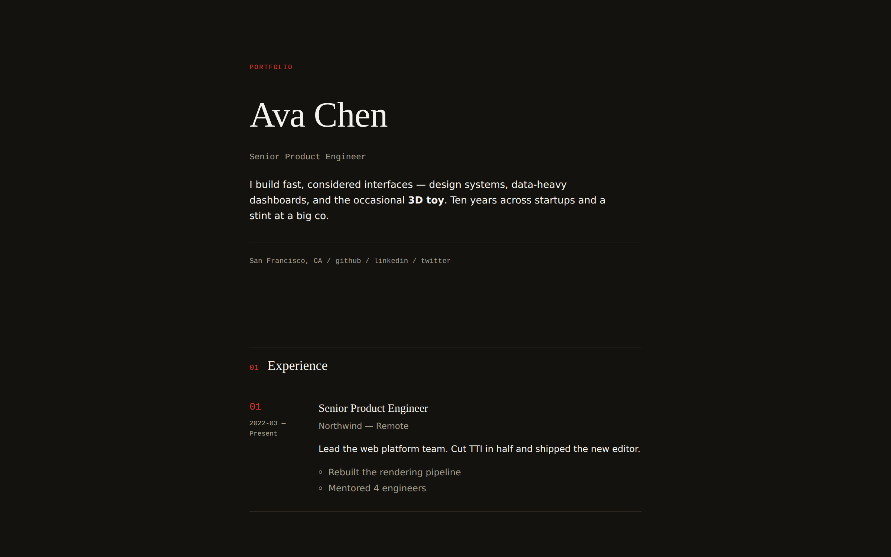
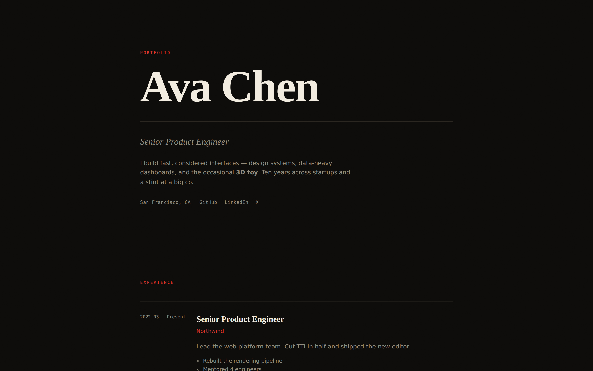
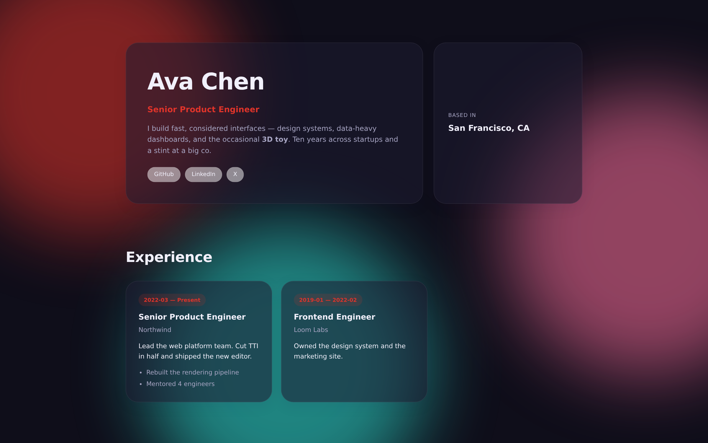
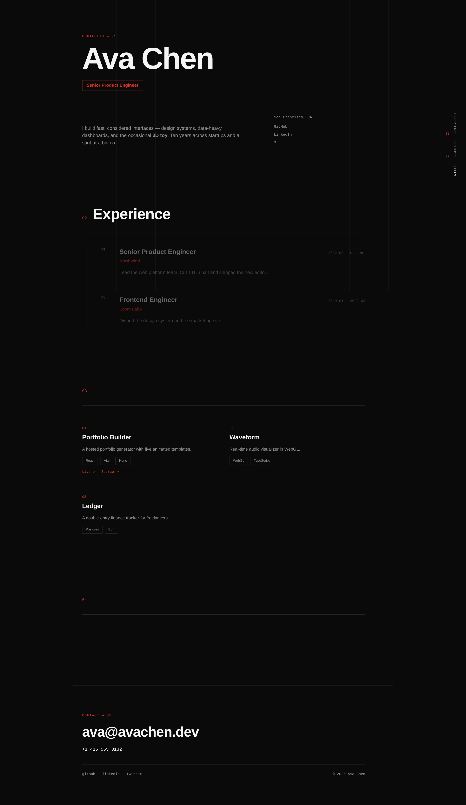
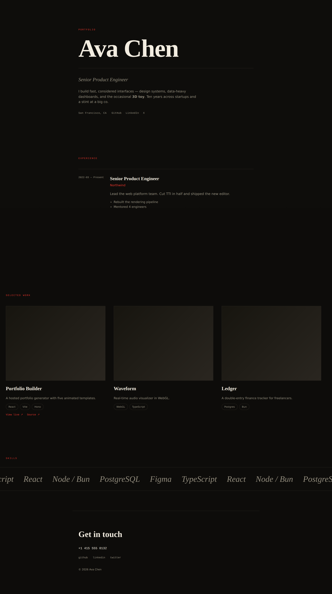
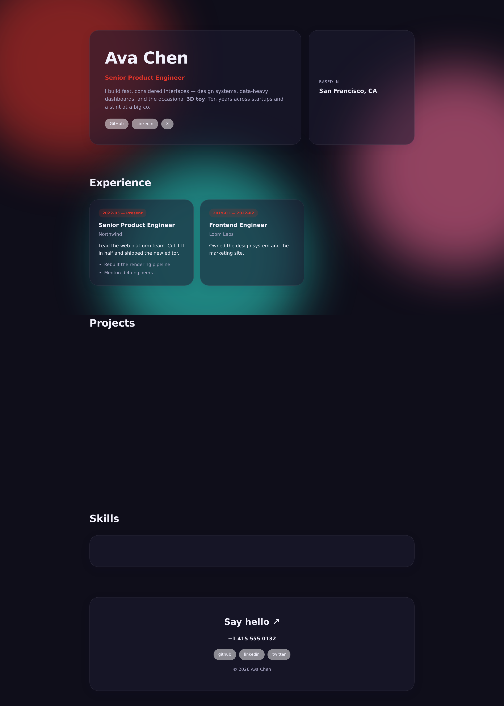

# @pb/templates

Shared schema, the five portfolio templates, and the build scaffold
for [Portfolio Builder](https://github.com/darshan260802/portfolio-ui).
Consumed as a `github:` dependency by both
[`portfolio-ui`](https://github.com/darshan260802/portfolio-ui) and
[`portfolio-api`](https://github.com/darshan260802/portfolio-api).

<p align="center">
  <a href="docs/screenshots/atlas.png"></a>
  <a href="docs/screenshots/aurora.png"></a>
  <a href="docs/screenshots/monolith.png"></a>
  <a href="docs/screenshots/nocturne.png"></a>
  <a href="docs/screenshots/prism.png"></a>
</p>

---

## What's here

Five hand-designed React templates that render one shared
`PortfolioData` object. Each is a real, animated site — not a static
image — with its own typography, motion, and layout language.
Everything the builder UI, the ZIP export, and the hosted build need to
render or generate a portfolio lives in this one package.

## The templates

<table>
  <tr>
    <td align="center" width="33%">
      <a href="docs/screenshots/atlas.png"></a>
      <h3>Atlas</h3>
      <p><em>Minimal · Editorial · Grid · Bold · Animated</em></p>
      <p>A Swiss-grid portfolio — one typeface at many weights, a signal-red accent, and a scroll-scrubbed numbered experience index. Systematic and confident.</p>
    </td>
    <td align="center" width="33%">
      <a href="docs/screenshots/aurora.png"></a>
      <h3>Aurora</h3>
      <p><em>Animated · Gradient · Developer · Single-page</em></p>
      <p>Gradient hero, scroll-revealed sections, and a project grid — the crowd-pleaser default when you want it to look great everywhere.</p>
    </td>
    <td align="center" width="33%">
      <a href="docs/screenshots/monolith.png"></a>
      <h3>Monolith</h3>
      <p><em>Minimal · Editorial · Serif · Light</em></p>
      <p>Restrained, numbered sections and generous whitespace. For people who want their work to speak, not their template.</p>
    </td>
  </tr>
  <tr>
    <td align="center" width="33%">
      <a href="docs/screenshots/nocturne.png"></a>
      <h3>Nocturne</h3>
      <p><em>Dark · Editorial · Serif · Luxury</em></p>
      <p>A pinned title reveal, a horizontally-scrolling project gallery, and a marquee skills ticker. Oversized serif type against near-black, brass accent.</p>
    </td>
    <td align="center" width="33%">
      <a href="docs/screenshots/prism.png"></a>
      <h3>Prism</h3>
      <p><em>Colorful · Glassmorphism · Bento · Playful · Creative</em></p>
      <p>Glassmorphic bento grid over a living gradient backdrop. For designers and creatives who want to show personality.</p>
    </td>
    <td width="33%"></td>
  </tr>
</table>

## Feature highlights

| Feature | What it does |
|---|---|
| **One schema, every template** | `src/schema.ts` is the single source of truth. Templates render whatever sections are present and gracefully skip the rest — adding an optional field never breaks a template. |
| **Prebuilt, isolated `dist/`** | Each template ships as a code-split ESM chunk with the React Compiler already applied. Consumers install the artifact; no build step runs on `bun install`. |
| **Loaders map, not template literals** | `src/loaders.ts` is a static `{ id: () => import(...) }` map (Rolldown can't code-split a dynamic template-literal specifier). The web app's preview iframe is the only consumer allowed to import it. |
| **Scaffold shell for export & hosting** | `scaffold/` is a real Vite + React project template. The API materializes it per deploy — same shell for the hosted build and the ZIP download. |
| **Deliberately narrow rich-text** | `src/rich-text.tsx` renders the sanitized HTML (`p / strong / em / a / ul / ol / li` only) the API allows — the exact surface the wizard's TipTap editor produces. |
| **Optional phone with derived `tel:` link** | The schema stores whatever separators the user typed; each template's footer strips them for the href, so display and dialability stay independent. |

## Who it's for

- **The Portfolio Builder stack.** The web app renders templates in a
  preview iframe; the API materializes them into a real Vite project
  and builds it.
- **Anyone forking a template.** Each `src/templates/<id>/` is a
  self-contained example of a modern React 19 + GSAP/Motion site with
  no framework beyond Vite.

## Full renders

<p align="center">
  <a href="docs/screenshots/atlas.png"></a>
  <br /><em>Atlas — the signal-red accent, the numbered rail, the oversized display type.</em>
</p>

<p align="center">
  <a href="docs/screenshots/nocturne.png"></a>
  <br /><em>Nocturne — dark-first, brass accent, editorial serif.</em>
</p>

<p align="center">
  <a href="docs/screenshots/prism.png"></a>
  <br /><em>Prism — glassmorphic bento cards over a living gradient.</em>
</p>

(See `docs/screenshots/` for Aurora and Monolith.)

---

## Layout

```
src/
  schema.ts          The PortfolioData Zod schema. One source of truth.
  meta.ts            TemplateManifest[]. Safe for the builder UI to import — pure data.
  loaders.ts         GENERATED. Static import() map used only by the preview iframe.
  rich-text.tsx      Renders the sanitized HTML the API allows (p/strong/em/a/ul/ol/li).
  templates/<id>/    manifest.ts (pure data), Template.tsx, styles.css, sections/
scaffold/            The standalone Vite project shell (both ZIP export and hosted build).
  *.tmpl             `__PLACEHOLDER__` tokens substituted by the API at build time.
scripts/
  build-dist.ts      Builds each template into dist/<id>/{index.js,index.css}.
  prewarm.ts         Pre-installs the scaffold's node_modules per template into .prewarm/.
dist/                COMMITTED. What consumers actually load.
```

## Commands

```sh
bun install
bun run build      # build:templates (dist/) then build:core (dist/core/)
bun run prewarm     # pre-install scaffold node_modules per template into .prewarm/
bun run typecheck
bun run lint
```

**Run `bun run build` (and commit the result) before pushing any change
under `src/templates/`, `src/schema.ts`, or `src/rich-text.tsx`.** The
committed `dist/` is what consumers install — `bun install` does not
reliably run a `prepare` script for `github:` dependencies.

## Isolation invariant

The builder UI must never import `src/loaders.ts` (or anything that
transitively imports a `Template.tsx`). That's what keeps template code
— and template CSS — out of the main app bundle. `src/meta.ts` is the
sanctioned door: pure data, safe to import from anywhere.

The web app enforces this at the entry level (`preview.html` →
`src/preview.tsx` is the only thing that imports `@pb/templates/loaders`)
and it was verified against a real built bundle: the builder's
`main`/`core` chunks contain zero template-specific strings.

## Adding a template

1. Create `src/templates/<id>/` with `manifest.ts` (pure data,
   including `thumbnail` URL), `Template.tsx`, `styles.css`, and a
   `sections/` folder if the template has any.
2. Add the manifest to `TEMPLATES` in `src/meta.ts`.
3. Run `bun run build` — the loaders map regenerates from what's on
   disk, and `dist/<id>/` gets populated.
4. Run `bun run prewarm` if the template introduces a new peer dep the
   scaffold doesn't already carry.
5. Commit `src/templates/<id>/`, the updated `src/meta.ts`, the
   regenerated `src/loaders.ts`, and the new `dist/` output.

## Adding a schema field

1. Add it to `src/schema.ts` (make it optional unless it truly must
   exist — templates render what's there and skip what isn't).
2. Render it in whichever templates want to. Others simply ignore it.
3. Rebuild (`bun run build`) and commit `dist/`.
4. Bump the pin in `portfolio-ui` and `portfolio-api`'s `bun.lock`
   together. The wizard types against `PortfolioData`, so the two
   lockfiles must move in lockstep.
